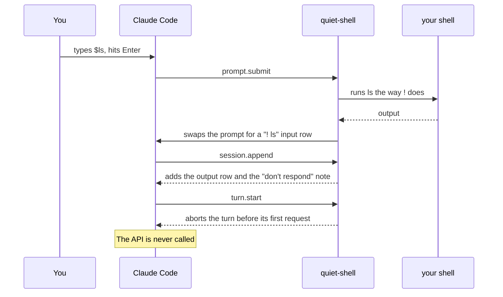

<h1 align="center">quiet-shell</h1>

<p align="center">
  <b><code>!ls</code> makes Claude reply. <code>$ls</code> doesn't.</b>
</p>

<p align="center">
  A second shell prefix for Claude Code. <code>$</code> runs your command and shows the output
  exactly the way <code>!</code> does, then gets out of the way.<br>
  No model call. No tokens. No waiting.
</p>

<p align="center">
  
  
  
</p>

<p align="center">
  
</p>

<p align="center">
  <a href="#install">Install</a> ·
  <a href="#-vs-">! vs $</a> ·
  <a href="#how-it-works">How it works</a> ·
  <a href="#limitations">Limitations</a> ·
  <a href="#faq">FAQ</a>
</p>

---

## Why

Since v2.1.186, Claude responds to every `!` command. That's great for
`! npm test`. It's pure overhead for `! ls`, `! pwd`, `! git status` and
`! code .`: you sit through a reply you didn't want, and you pay for it in
tokens.

The setting `respondToBashCommands: false` turns the reply off for **every**
`!` command, so then you can't get one when you do want it.

quiet-shell gives you both, per command:

```text
! npm test       # runs; Claude reads the output and answers
$ ls             # runs; that's it
```

## Install

In Claude Code 2.1.287 or later, run these two commands:

```text
/plugin marketplace add am-shb/cc-quiet-shell
/plugin install quiet-shell@cc-quiet-shell
```

The second one opens quiet-shell's details. Choose **Install for you (user
scope)**. It's active right away, even mid-conversation, with no restart.
Type `$` into an empty prompt (it turns pink), add a command, and hit Enter.

It needs bash or zsh, so macOS, Linux or WSL.

<details>
<summary>Install from your shell instead</summary>

```sh
claude plugin marketplace add am-shb/cc-quiet-shell
claude plugin install quiet-shell@cc-quiet-shell
```

It loads in your next session. In a session that's already open, run
`/reload-plugins`.

</details>

<details>
<summary>Update or uninstall</summary>

|  | In Claude Code | From your shell |
|---|---|---|
| **Update** | `/plugin marketplace update cc-quiet-shell` | `claude plugin marketplace update cc-quiet-shell`<br>`claude plugin update quiet-shell@cc-quiet-shell` |
| **Uninstall** | `/plugin uninstall quiet-shell@cc-quiet-shell`, then Esc | `claude plugin uninstall quiet-shell@cc-quiet-shell` |

In Claude Code, both apply right away. From your shell, they apply in your
next session, or after `/reload-plugins` in an open one.

Updates don't arrive on their own, because auto-update is off by default for
third-party marketplaces. To turn it on, run `/plugin`, open
**Marketplaces**, select **cc-quiet-shell** and choose **Enable
auto-update**.

`/plugin marketplace remove cc-quiet-shell` removes the marketplace and
uninstalls quiet-shell along with it.

</details>

<details>
<summary>Without the plugin manager</summary>

Clone it into your skills folder. It loads in every session, and `git pull`
updates it:

```sh
git clone https://github.com/am-shb/cc-quiet-shell ~/.claude/skills/quiet-shell
```

Or load a checkout for one session only:

```sh
claude --plugin-dir /path/to/cc-quiet-shell
```

To load a checkout in every session, add it to the `env` block of
`~/.claude/settings.json`:

```json
{ "env": { "CLAUDE_CODE_PLUGIN_DIRS": "/path/to/cc-quiet-shell" } }
```

Remove the clone with `rm -rf ~/.claude/skills/quiet-shell`.

Pick one method. Only one copy of quiet-shell ever loads. If it's both
installed and cloned into `~/.claude/skills`, the installed copy wins and
`/plugin` lists the clone under **Errors**.

</details>

## `!` vs `$`

|  | `!cmd` | `$cmd` with quiet-shell |
|---|:---:|:---:|
| Runs in your shell: aliases, functions, `.bashrc`, current directory | ✅ | ✅ |
| Command and output shown in the transcript | ✅ | ✅ identical rows |
| Claude sees it as context on your next prompt | ✅ | ✅ |
| Starts a model turn | yes | **no** |
| Tokens spent | yes | **0** |
| Waiting for a reply | yes | **no** |
| Prompt switches into shell mode (pink border, `!` glyph) | ✅ | ❌ a pink `$` in a normal prompt ([why](#limitations)) |


## How it works

quiet-shell is a **mod**, a plugin of function hooks, written against
Claude Code's early-access hooks API. It hooks six events:



| Hook | Job |
|---|---|
| `session.start` | Loads the `$` commands you've run before, so one recalled from history runs quietly again. |
| `prompt.edit` | Arms on a `$` typed or pasted into an empty prompt (outside `!` mode) and paints it pink. |
| `prompt.submit` | Runs the command with the same script Claude Code uses for `!`: your shell snapshot, the same stdin and stderr handling, the same output formatting. |
| `session.append` | Stores the result as the exact rows a no-reply `!` command stores. |
| `turn.start` | Ends the turn before it sends anything. |
| `ui.render` | While the command runs, draws `! cmd` / `⎿  Running…` like `!` does, and hides the spinner. |

All the logic is in [`hooks/register.tsx`](hooks/register.tsx) and
[`hooks/quiet.ts`](hooks/quiet.ts), about 700 lines including comments.

## Limitations

The mod API in 2.1.287 can't do everything. Here's every place `$` differs
from `!`:

- **The prompt doesn't switch into shell mode.** The `$` is a pink character
  in a normal prompt. You still see the `❯` glyph, the border stays gray, the
  footer stays as it is, and ↑ history isn't filtered to shell commands.
  Backspace deletes the `$` rather than leaving a mode.
- **Two cases add a notice row.** Pressing Enter on `$` alone, or Esc while a
  `$` command runs (the command is killed and put back in the box, as with
  `!`), adds `● Prompt dropped by a hook: …` to the transcript.
- **Your `UserPromptSubmit` settings hooks run** for `$` commands. `!` skips
  them.
- **Long-running commands show only `Running…`.** You get no live output tail,
  no timer and no ctrl+b to background. A `$` typed while Claude is busy waits
  for the turn and can't be interrupted once it starts.
- **`$cd` doesn't stick** for later commands.
- **Terminal only.** Remote Control, the SDK and the desktop composer are not
  handled. zsh hasn't been tested end to end.

<details>
<summary>Why the prompt can't look like shell mode</summary>

No mod API reaches the prompt's input mode. `$.prompt` offers `submit`,
`read`, `fill`, `suggest` and `compose`, and `fill` resets the box to prompt
mode. A `prompt.edit` hook can rewrite the draft, but Claude Code applies
its answer only after the typed `$` is already in and the cursor has moved
past it. Shell mode starts only from a `!` typed at the very start, so
answering `!` gives you a literal `!`. No keybinding switches modes, and the
prompt box and footer aren't render sites. The notice rows come from the
same constraint: by the time a hook sees a prompt it has been sent, and the
only way to stop it adds that notice.

</details>

## FAQ

**Does Claude still know what I ran?**
Yes. On your next prompt Claude sees each `$` command and its output, with the
same note Claude Code attaches to no-reply `!` commands. You can say "what do
you make of that?" whenever you like.

**Is it really free?**
A `$` command sends nothing to the API. The turn Claude Code would start is
aborted before its first request, and the tests above count requests, not
just tokens.

**Does it break prompts that start with `$`?**
Only a `$` typed or pasted into an *empty* prompt arms it, and you can see it
happen because the `$` turns pink. A `$` anywhere else is plain text. A
prompt can't start with `!` today either.

**Is it safe?**
It runs exactly what you typed after the `$`, in your shell, like `!` does. If
something goes wrong inside the mod before the command runs, it fails closed:
the `$` prompt is dropped and never sent to Claude.

**Will it survive Claude Code updates?**
It's built on an early-access API and mirrors some engine behavior, such as
shell snapshots and the output row format. In a clone, `claude plugin test .`
checks it against the Claude Code you have. Open an issue if something
drifts.

## Development

```sh
claude plugin validate .                            # the marketplace
claude plugin validate .claude-plugin/plugin.json   # the mod
claude plugin test .
claude --plugin-dir .   # try your changes; for that session they replace an installed copy
tsc -p .   # after Claude Code has loaded the mod once (it writes .claude-plugin/types/)
```

To ship a release, bump `version` in `.claude-plugin/plugin.json`. Copies
installed through `/plugin` update only when it changes.

---

<p align="center">
  If <code>$</code> saved you a few seconds today, a ⭐ helps the next person find it.
</p>
